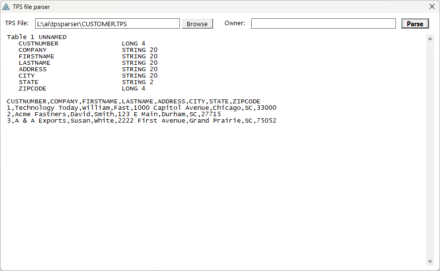
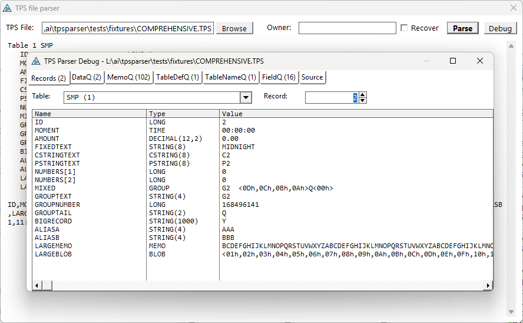

# TpsParserType

`TpsParserType` is a reusable Clarion class for reading records, fields, memos, and blobs from TPS files. Parsing is strict by default. Explicit recovery entry points can skip malformed pages and use bounded BLOB fallbacks.



## Attribution and license

This parser is a Clarion port/adaptation of logic from the original Java project `ctrl-alt-dev/tps-parse`.

Original project attribution:

- Project: `ctrl-alt-dev/tps-parse`
- URL: https://github.com/ctrl-alt-dev/tps-parse
- Author / copyright: (C) 2012-2021 E. Hooijmeijer / Erik Hooijmeijer
- Organization / site: ctrl-alt-dev, http://www.ctrl-alt-dev.nl/
- License: Apache License 2.0, https://www.apache.org/licenses/LICENSE-2.0.html
- Local license copy: `Apache-2.0.txt`

The original project describes itself as reverse-engineered TPS parsing software. Its warning applies here as well: TPS parsing may be incomplete and may misinterpret data; verify output before relying on it.

## Files

Include these files in your Clarion project:

- `TpsParser.inc` - class declaration and queue types
- `TpsParser.clw` - class implementation

Include the class in your source:

```clarion
  INCLUDE('TpsParser.inc'),ONCE
```

## Debug inspector

The `Test` project includes a Debug button that opens a resizable inspector for parsed TPS state. Its Records tab selects a table and record, then lists each field's name, Clarion type, and value; arrays use one row per element, while binary and BLOB previews use Clarion-style hexadecimal escapes. Additional tabs expose the parser's internal queues and loaded source bytes.



The debug window code and original idea were contributed by [CarlTBarnes](https://github.com/CarlTBarnes) in [PR #1](https://github.com/CarlosGtrz/tpsparser/pull/1). The current inspector builds on that contribution.

## Basic usage

```clarion
Parser  TpsParserType
Result  LONG

Result = Parser.Init('C:\data\MyFile.tps')
IF Result <> 0
  MESSAGE('Could not open/parse TPS. Error=' & Parser.GetError())
  RETURN
END

Parser.Set()                  ! start before first record
LOOP UNTIL Parser.Next()      ! Next returns FALSE when a record is available
  ! Read fields here
END

Parser.Kill()
```

## Encrypted files

For encrypted TPS files, pass the owner/password to the overloaded `Init` method:

```clarion
Result = Parser.Init('C:\data\Encrypted.tps','owner-password')
```

The owner string is used as Clarion string bytes directly; no code-page conversion is applied.

If the file is already plaintext, supplying an owner is harmless: the parser recognizes the valid plaintext header before attempting decryption.

## Strict and recovery parsing

The existing `Init` overloads are strict:

```clarion
Result = Parser.Init(FileName)
Result = Parser.Init(FileName,Owner)
```

Recovery can be requested explicitly:

```clarion
Result = Parser.Init(FileName,Owner,TRUE)
Result = Parser.InitRecovering(FileName)
Result = Parser.InitRecovering(FileName,Owner)
```

Clarion cannot distinguish an `Init(STRING,BYTE)` overload from the existing `Init(STRING,STRING)` overload. `InitRecovering(FileName)` provides the unambiguous ownerless form.

Recovery discards every record, MEMO fragment, table-definition fragment, and table name staged from a malformed page. It continues with later pages. Strict mode aborts at the first malformed block, page, RLE stream, record stream, field layout, or record value.

## Reading field values

Use `GetField` for a string representation of the field value:

```clarion
NameText = Parser.GetField('Name')
NameText = Parser.GetFieldByNumber(1)
DateText = Parser.GetField('InvoiceDate')   ! formatted with @D10-B
TimeText = Parser.GetField('InvoiceTime')   ! formatted with @T04B
AmountText = Parser.GetField('Amount')      ! numeric auto-converted by Clarion
```

Use typed getters when assigning to typed Clarion fields:

```clarion
Rec:Name        = Parser.GetStringField('Name')
Rec:Active      = Parser.GetByteField('Active')
Rec:Quantity    = Parser.GetLongField('Quantity')
Rec:InvoiceDate = Parser.GetDateField('InvoiceDate')
Rec:InvoiceTime = Parser.GetTimeField('InvoiceTime')
```

For raw bytes:

```clarion
RawValue = Parser.GetRawField('SomeField')
```

Ordinary fixed `STRING` values have trailing NUL and space padding removed. `GROUP` is deliberately different: both `GetStringField` and `GetRawField` return the complete fixed-width element byte-for-byte, including binary members, embedded NULs, and unused gaps. Nested fields inside a GROUP remain independently addressable by their own field names.

String-returning methods use a class-owned exact-size scratch buffer for variable-length results. Copy a returned value into the caller's variable before calling another string-returning method on the same parser instance.

## Reading blobs

Blob fields are copied into a Clarion `BLOB` field:

```clarion
Result = Parser.GetBlobField('DocumentBlob',TargetFileBlob)
```

If you do not need the result code, the method can be called as a procedure:

```clarion
Parser.GetBlobField('DocumentBlob',TargetFileBlob)
```

## Arrays / DIM fields

`GetFieldDimension('FieldName')` returns the total number of array elements. TPS metadata stores arrays flattened, so `DIM(3,5)` is exposed as `15` elements.

Array field getters use a 1-based flattened index:

```clarion
Elements = Parser.GetFieldDimension('Scores')
Score1 = Parser.GetLongField('Scores',1)
Score2 = Parser.GetLongField('Scores',2)
```

Scalar fields ignore the dimension parameter.

## Multiple tables / superfiles

```clarion
TableCount = Parser.Tables()
LOOP T# = 1 TO TableCount
  TableName = Parser.GetTableName(T#)
  IF Parser.SetTable(T#) = 0
    ! read records for this table
  END
END
```

## Useful metadata methods

```clarion
RecordCount = Parser.Records()
FieldCount  = Parser.Fields()
FieldName   = Parser.GetFieldNameByNumber(1)
FieldType   = Parser.GetFieldType('Name')
FieldTypeNo = Parser.GetFieldTypeByNumber(1)
FieldSize   = Parser.GetFieldSize('Name')       ! string length, numeric bytes, BCD digits
Decimals    = Parser.GetFieldDecimals('Amount') ! BCD decimals, otherwise 0
FieldNo     = Parser.GetFieldNumber('Name')
ErrorCode   = Parser.GetErrorCode()
ErrorText   = Parser.GetError()
```

`GetFieldType` / `GetFieldTypeByNumber` return Clarion-style type names. Current possible values are:

```text
BYTE
SHORT
USHORT
DATE
TIME
LONG
ULONG
SREAL
REAL
DECIMAL
STRING
CSTRING
PSTRING
GROUP
MEMO
BLOB
UNKNOWN
```

## Return values

These methods return parser error codes:

| Method | Return value |
| --- | --- |
| `Init(fileName)` | `0` on success, otherwise `GetErrorCode()` |
| `Init(fileName,owner)` | `0` on success, otherwise `GetErrorCode()` |
| `Init(fileName,owner,ignoreErrors)` | `0` on success, otherwise `GetErrorCode()` |
| `InitRecovering(fileName)` | `0` on success, otherwise `GetErrorCode()` |
| `InitRecovering(fileName,owner)` | `0` on success, otherwise `GetErrorCode()` |
| `SetTable(tableIndex)` | `0` on success, otherwise `GetErrorCode()` |
| `Get(recordNo)` | `0` on success, otherwise `GetErrorCode()` |
| `Set(recordNo = 0)` | `0` on success, otherwise `GetErrorCode()` |
| `GetBlobField(...)` | `0` on success, otherwise `GetErrorCode()` |
| `GetBlobFieldByNumber(...)` | `0` on success, otherwise `GetErrorCode()` |

`Next()` intentionally keeps Clarion iterator/EOF semantics instead of error-code semantics:

| Method | Return value |
| --- | --- |
| `Next()` | `FALSE` when a record is available, `TRUE` at EOF |

Typical loop:

```clarion
Result = Parser.Set()
IF Result <> 0
  MESSAGE(Parser.GetError())
  RETURN
END

LOOP UNTIL Parser.Next()
  ! record is available
END
```

## Error codes

`GetErrorCode()` returns one of these parser error codes. Matching `TpsErr...` equates are declared in `TpsParser.inc`. `GetError()` returns the matching single-line message, with runtime context such as file name, offset, table, field, memo, value, byte count, or Clarion `ERRORCODE()` when available.

### Source file errors

| Code | Message |
| ---: | --- |
| 1001 | Could not open source file |
| 1002 | Source file is empty |
| 1003 | Could not read source file |

### TPS header errors

| Code | Message |
| ---: | --- |
| 1101 | Source is too short to be a TPS file |
| 1102 | Invalid TPS header marker |
| 1103 | Invalid TPS header size |
| 1104 | Invalid TPS signature |
| 1105 | Invalid TPS block range |
| 1106 | Invalid TPS page |
| 1107 | Invalid TPS RLE stream |
| 1108 | Invalid TPS record stream |

### Encrypted TPS errors

| Code | Message |
| ---: | --- |
| 1201 | Encrypted TPS is too short to decrypt header |
| 1202 | Encrypted TPS decrypt failed at header |
| 1203 | Encrypted TPS decrypt failed; bad owner/password or invalid header marker |
| 1204 | Encrypted TPS decrypt failed; bad owner/password or invalid signature |
| 1205 | Encrypted TPS decrypt failed for a data range |
| 1206 | Decrypt range is outside source |
| 1207 | Decrypt range is not 64-byte aligned |

### Table selection errors

| Code | Message |
| ---: | --- |
| 1301 | Invalid table index |

### Table layout / metadata errors

| Code | Message |
| ---: | --- |
| 1401 | No table definitions found |
| 1402 | Incomplete table definition |
| 1403 | Incomplete field definition header |
| 1404 | Incomplete field definition body |
| 1405 | Incomplete BCD metadata |
| 1406 | Incomplete string metadata |
| 1407 | Incomplete string external-name marker |
| 1408 | Incomplete memo external-name marker |
| 1409 | Incomplete memo definition |
| 1410 | No fields found in table definition |
| 1411 | Invalid field layout or record data |
| 1412 | Unsupported TPS field type |
| 1413 | Ambiguous case-insensitive full/short field, MEMO, or BLOB name |

### Record navigation errors

| Code | Message |
| ---: | --- |
| 1501 | Invalid record index |
| 1502 | Record index not found |

### MEMO/BLOB read errors

| Code | Message |
| ---: | --- |
| 1601 | Invalid blob read context |
| 1602 | Field is not MEMO/BLOB |
| 1603 | Malformed BLOB length header or payload |

## Fixtures and regression tests

The deterministic fixtures under `tests\fixtures` are generated by `GenerateFixtures.clw`. Normal test runs consume the committed files; rerun the generator only when fixture coverage changes.

`ParserTests.clw` is non-interactive and exits nonzero on the first failed assertion. `tests\RunRegression.ps1` builds it, creates disposable corrupted copies for page-count, RLE, page-boundary, fragment, and BLOB recovery checks, runs it, and removes those copies.

```powershell
.\tests\RunRegression.ps1 -Configuration Debug
.\tests\RunRegression.ps1 -Configuration Release
```

The fixtures cover TIME seconds/hundredths and midnight, scaled DECIMAL values below one and zero, fixed/C/P strings, arrays, binary GROUP content, a 40,000-byte record, a 12 KB MEMO, a 40 KB multi-chunk BLOB, ambiguous aliases, `UNNAMED` table fallback, ASCII owner encryption, and owner calls on plaintext files. Because the Clarion TopSpeed driver rejects declarations above its record-size ceiling, the large-record TPS is assembled byte-for-byte by the Clarion generator and is also accepted by the C# reference parser.

## Notes

- `Init`, `SetTable`, `Get`, `Set`, and blob getters return `0` on success or a parser error code on failure.
- `GetErrorCode()` returns the numeric error code. `GetError()` returns a single-line diagnostic string with extra context when available.
- `Next` returns `FALSE` when a record is available and `TRUE` at EOF; it does not return an error code.
- Call `Kill` when finished to release parser buffers and queues.
- Index metadata is intentionally not exposed.
- Recovery is opt-in. A recovered oversized or negative BLOB length returns only the available payload bytes; a missing length header returns an empty BLOB.
